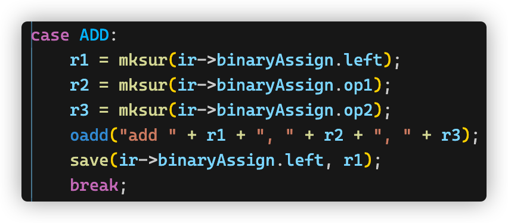

# 实验报告

## 实现的功能

在正确的中间代码基础上，进行目标代码生成

**实现方法**

遍历每条中间代码，根据不同的类型生成不同的目标代码。使用了朴素的寄存器分配，自己约定了 \$2 是返回值，\$3 是保存函数现场的栈地址，\$sp 是通用栈地址，\$8 及之后是通用的寄存器

对于每个函数，都会记录用到了哪些变量和数组，以便在递归的时候保存现场

对于每个变量都为其开辟一个内存空间

对于每个含有变量的中间代码，都先取出变量值到寄存器，再运算，最后存回到内存

比如加法赋值，分别取出三个操作数，放到对应的寄存器，再对寄存器运算，最后把结果的寄存器保存回对应内存

**精巧设计**

- 额外有一个内存空间来存储“函数用来保存现场的栈”，而不是使用通用栈，减少代码复杂度

## 有趣的现象

提交的测试点中有 3 个点都出现了一模一样的输出`Invalid address (0x00410000) for instruction`，我以为是因为我没正确实现递归函数，就增加了保存函数现场的功能，还是错误；我又增加了保护函数内数组的功能，还是错误。我以为是函数跳转出问题，在本地又尝试了非常复杂的函数调用，没出现这个错误。之后偶然生成了一个非常长，超过 16000 行的代码后，在本地复现了这个错误。联系助教帮忙修改代码区大小后，问题解决

朴素寄存器分配太浪费代码行数了嘤嘤嘤

## BUG 们

- read 到的值没有保存
- 变量从内存赋值到寄存器后，寄存器被覆盖
- 赋值给解引用变量的时候，指令写错
- 对于名字短的函数，名字需要加上一些字符才能被 spim 认为是函数
