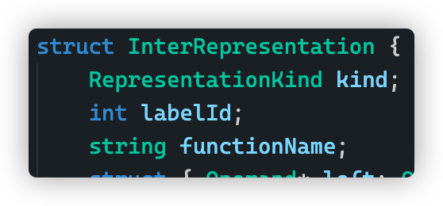
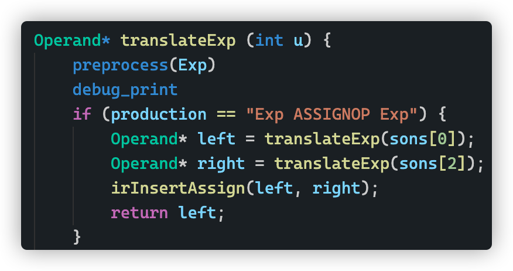
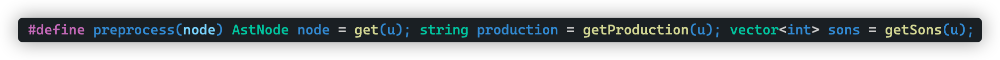
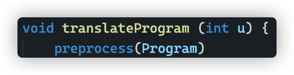

# 实验报告

## 实现的功能

在正确的语法树基础上，进行中间代码生成

**实现方法**

建立中间代码行的 struct ，根据要求的中间代码的不同类型，在 struct 中设置不同的字段来表示。图中为开头

这里用 union 会更好的，但是因为有 string 字符串，我想不到怎么处理，于是就没有用 union 。

另外也给中间代码的操作数、变量设置结构体来表示。

用和语义分析一样的方法遍历语法树，为每一个可以翻译的节点设置一个翻译函数，翻译成对应的中间代码。

没有对中间代码进行优化。

**精巧设计**

- 

  

  用宏来对每个树节点预处理，减少代码行数。

## 有趣的现象

中间代码函数名不输出或者输出乱码，因为一开始用了 union ，存的是 const char* ，用 string.c_str() 得到，但是因为 string 被销毁，名字也就丢了。（所以就去掉了 union 哈哈，直接用 string ）

## BUG 们

- 没有把 write 和 read 放到符号表
- 子节点的编号打错
- 新建“变量”时忘记返回这个“变量”的变量

