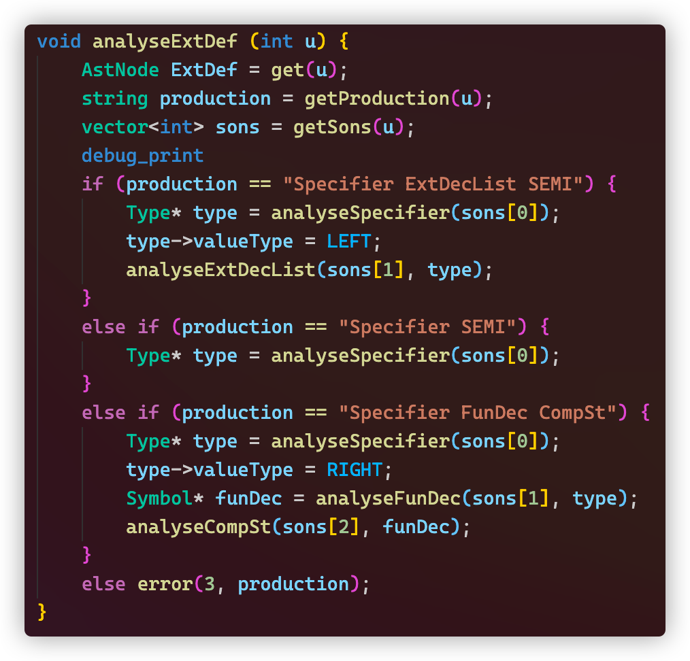
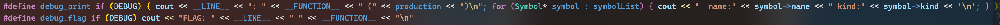
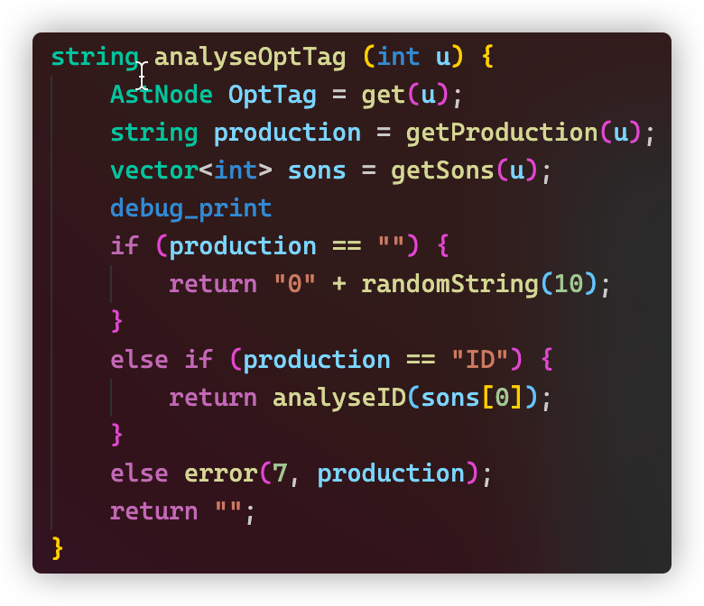

# 实验报告

## 实现的功能

在用语法分析建立的语法树的基础上，进行语义分析

**实现方法**

没有在 `syntax.y` 原地进行分析，而是在构建好的语法树上分析

给每一个非终结符写一个分析函数，根据不同的产生式分析不同的语法单元

比如

`u` 是当前节点的编号，`get(u) ` 获取当前节点的信息，`getProduction(u)` 获取当前节点用的是哪一条产生式，`getSons(u)` 获取当前节点的所有子节点编号。再根据不同的产生式对自节点作不同的分析

**精巧设计**

- 可以打开语义分析的“调试模式”，能够打印当前的函数、行数，能设一些标志

  

- 匿名结构体会自动产生一个 `0` 开头的随机字符串作为名称

  

## 有趣的现象

本来我的代码会把“结构体”的 `string` 类型的名称保存在“结构体”的结构体中的某个 `union` 字段中，然后每次给结构体名称赋值都会 `RE` 。查了很久也不知道哪里代码有问题。百度了才知道是对象不能放在 `union` 里

然后就决定除了符号表以外就不保存结构体的名称了

## BUG 们

- 把函数的返回值类型当成了符号的类型，而函数这种符号没有类型（有的是参数列表）
- 一开始没有在每个函数里面加 `sons` 动态数组，而是所有函数共用一个，导致当前语法单元的 `sons` 会被破坏
- 搞错子节点的序号