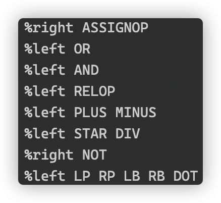
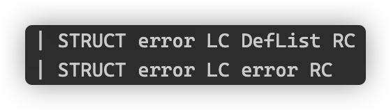
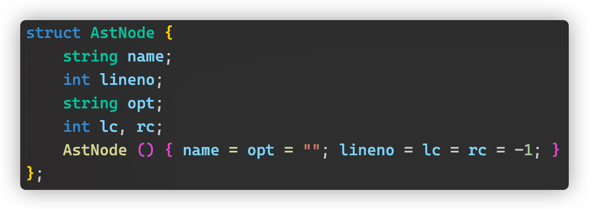
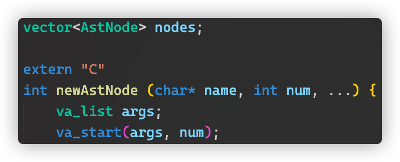
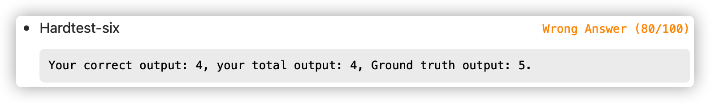
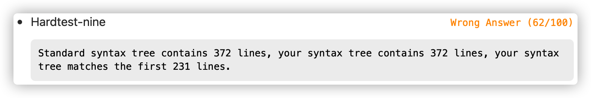

# 实验报告

## 实现的功能

在用 flex 解析词法的基础上，用 bison 解析语法，根据 c-- 的语法设置产生式，通过设置优先级和结合性解决冲突，通过替换语法单元设置错误恢复的点

**解决冲突**

根据实验指导设置 IF-ELSE 语句的优先级

根据运算符表设置优先级和结合性

**错误恢复**

找到可能产生错误的语法单元，在它的上一层语法单元的产生式中新增一条将其替换为 error 的产生式，如

另外还有一些根据其后出现的终结符设置恢复点

**精巧设计**

- 用抽象语法树的形式存储所有语法和词法单元，采用动态数组模拟链表的方式，采用左孩子右兄弟的树表示法，函数传值采用不定长参数

  

  

- 还有一个精(tou)巧(lan)设计是，能用 c++ 的 string 的地方都用 string ，把 c 风格的字符串都转成 string 方便偷懒

## 有趣的现象

我的测试分数是曲折上升的，<s>非常好地证明了马克思主义哲学唯物辩证法的发展观：事物发展是曲折性和前进性的统一</s>，特别是在改错误恢复的时候，经常某个地方一改，分数就变低，再改一个地方，又变高：我永远无法预知这一次提交究竟是能变高还是变低

## BUG 们

没有啥印象深刻的 BUG ，**因为它们都是刻骨铭心的**，比如没注意要输出到哪个文件，没注意是 32 位无符号整数，转换浮点数的时候忘记 "e" 可以是大写。还有一个比较大的 BUG 是，在词法阶段统计换行符的时候，为了在遇到换行符的时候将列数置一，就直接新增了一条换行符的规则，却忘记了换行符被包含在其他规则里，导致行数和列数统计出现错误

到写实验报告为止还有两个点没通过，调了很久很久也没解决，一个是错误恢复，一个是语法或词法不知道哪里出了问题，找不到 BUG 嘤嘤嘤

