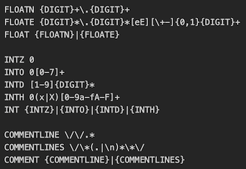
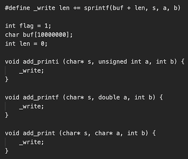

# 实验报告

## 实现的功能

解析 C-- 的词法，用 flex 为每一种词法单元设置正则表达式并生成解析代码。

**精巧设计**

- 对于有多种形式的同一种词法单元，用 “|” 连接若干正则表达式，让文件结构和正则表达式更清晰

  

- 对于所有正常的输出，先全部缓存到数组里面，等确认不存在错误后再输出。三种的不同输出缓存的函数虽然参数不一样，但是用同一种宏来实现

  

## 有趣的现象

我本来以为所有输出（包括正常输出和错误输出）全部输出到 stderr 中，然后得分 1500/2100 。然后我试着把正常输出输出到 stdout 中，错误输出输出到 stderr 中，然后得分 600/2100 。两种情况正好是互补的。迷惑。问了别人才知道在有错的时候，只需要输出错误就行。还是语文太差了嘤嘤嘤

## BUG 们

总共修了 3 个 bug ，除了上面提到的那个，还有 2 个。

一个是**无符号 32 位整数**，用了 unsigned int 就多了 3 分。

一个是 **float 和 double** ，要求里说精度是 float ，所以我代码里一开始也用了 float ，但是不对，改成 double 以后就多了 4 分。

